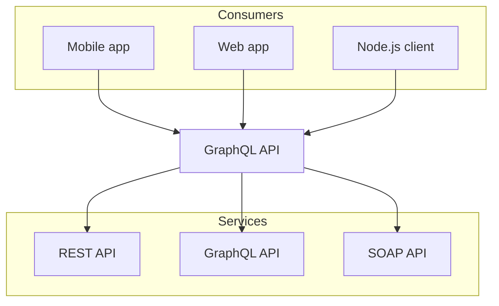

import CustomPlayground from '../components/CustomPlayground'

# About

<CustomPlayground
  source="## Hello world"
  fallback={<div>Loading playground...</div>}
/>

This is the about page! This page is shown on the navbar.

```sh npm2yarn
npm i -D @graphql-eslint/eslint-plugin
```


